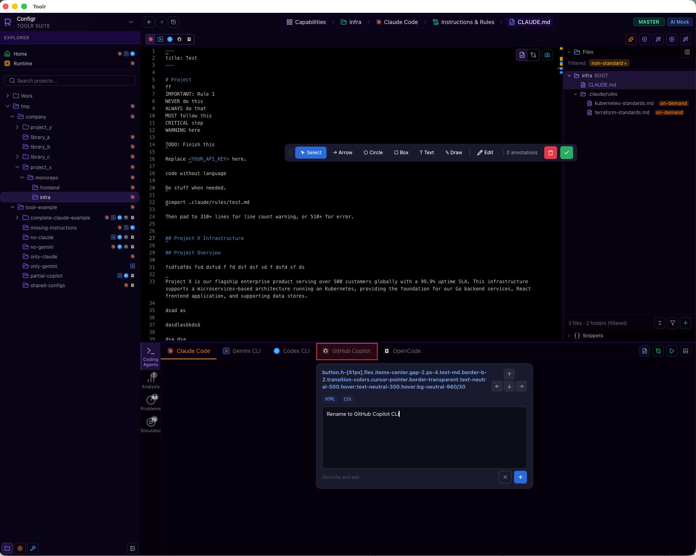

# tauri-plugin-redline

Visual UI annotation overlay for Tauri v2 desktop apps. Injects a Fabric.js-based drawing canvas into the WebView with native screenshot capture. Intended for debug builds.



## Features

- **Select** elements to annotate with comments
- **Draw** arrows, circles, boxes, freehand, and text annotations
- **Edit** existing annotations
- **Session persistence** — resume interrupted sessions
- **Native screenshots** via WKWebView `takeSnapshot` (macOS) — pixel-perfect capture
- **Structured JSON output** with selectors, computed CSS, and element metadata
- **Reset All** — clear annotations and start fresh

## Installation

Add to your `src-tauri/Cargo.toml`:

```toml
[dependencies]
tauri-plugin-redline = { git = "https://github.com/twiced-technology-gmbh/redline-plugin-tauri" }
```

Register the plugin on the Builder (**before** `.setup()`). The plugin uses `js_init_script` which must be registered before the WebView is created:

```rust
let mut builder = tauri::Builder::default()
    .plugin(tauri_plugin_shell::init());

// Only enable in debug builds
if cfg!(debug_assertions) {
    builder = builder.plugin(tauri_plugin_redline::init());
}

builder
    .setup(|app| {
        // ...
        Ok(())
    })
    .run(tauri::generate_context!())
    .expect("error while running tauri application");
```

Add `"redline:default"` to your capabilities in `src-tauri/capabilities/default.json`:

```json
{
  "permissions": [
    "redline:default"
  ]
}
```

## Usage

Press **Cmd+Option+Shift+A** (macOS) or **Ctrl+Alt+Shift+A** (Windows/Linux) to toggle the annotation overlay. Once active:

1. **Name the session** when prompted
2. **Select** elements or **draw** shapes to annotate
3. **Add comments** describing what needs to change
4. Press the shortcut again to **finish** — the annotation file downloads automatically

## Integration with AI Coding Agents

The downloaded JSON file contains structured annotation data ready for AI consumption:

```
/redline home-2026-03-11-14-30.json
```

A `SKILL.md` is included for Claude Code integration. Copy it to your project's `.claude/skills/redline/SKILL.md` to enable the `/redline` slash command.

## Platform Support

| Platform | Screenshot Method |
|----------|------------------|
| macOS | WKWebView `takeSnapshot` (native, pixel-perfect) |
| Windows | Fallback to foreignObject SVG |
| Linux | Fallback to foreignObject SVG |

## Requirements

- Tauri v2
- Rust 2021 edition

## License

MIT
